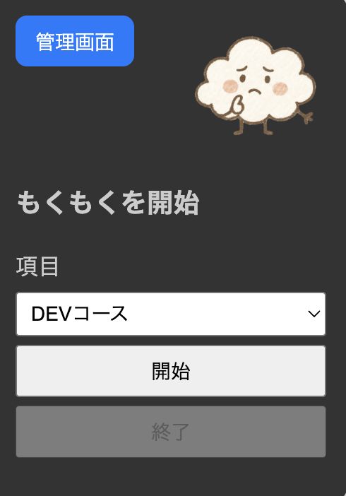
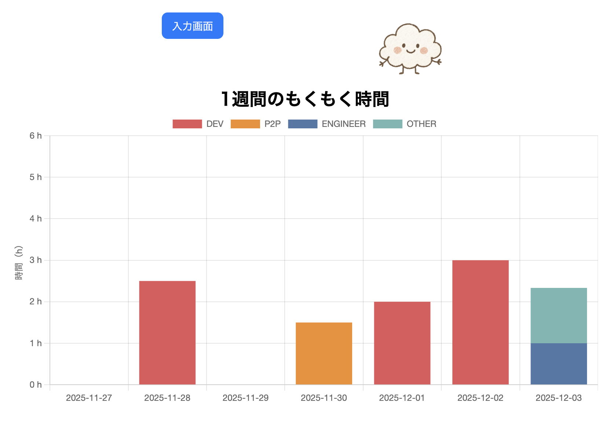

# MOKUMOKU TIMER（もくもく　タイマー）

## 1.制作物の説明

勉強時間（もくもく時間）を記録し、項目毎に自己分析をするアプリです。

### 入力画面

### 管理画面

### 使い方

1. 入力画面の項目を選択
2. 勉強開始時に開始ボタンを押す
3. 勉強終了時に終了ボタンを押す
4. 管理画面ボタンを押し、自己分析をする。

## 2.工夫した点・こだわった点

- Chart.js のライブラリを使用
- スマホでも OK

## 3.次回トライしたこと（または機能）

- 週、月単位での集計
- ローカルストレージの削除機能の追加

### 4.備考（感想、シェアしたいこと等なんでも）

今回 Chart.js のライブラリの棒グラフで作成を行っておりますが、他の円グラフ等の他グラフにも挑戦したいです。
